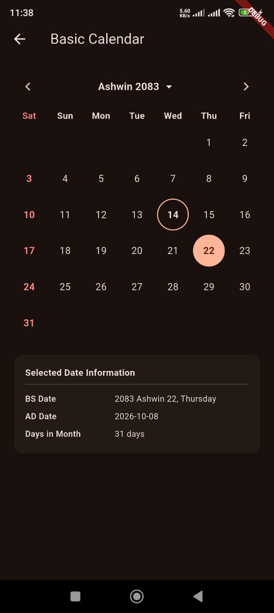
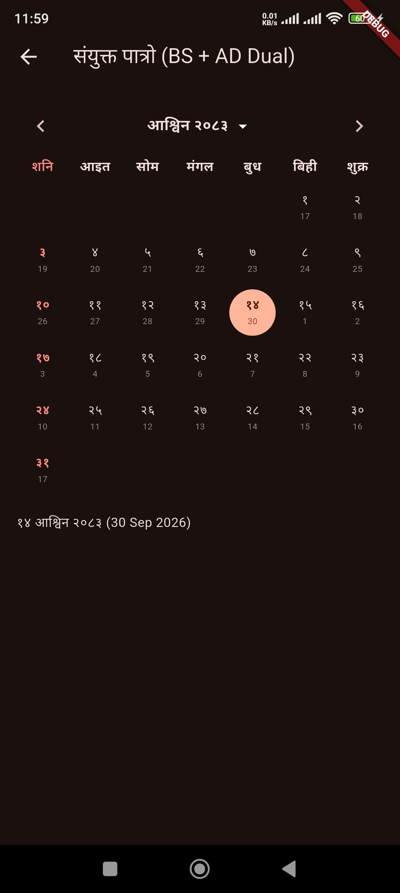
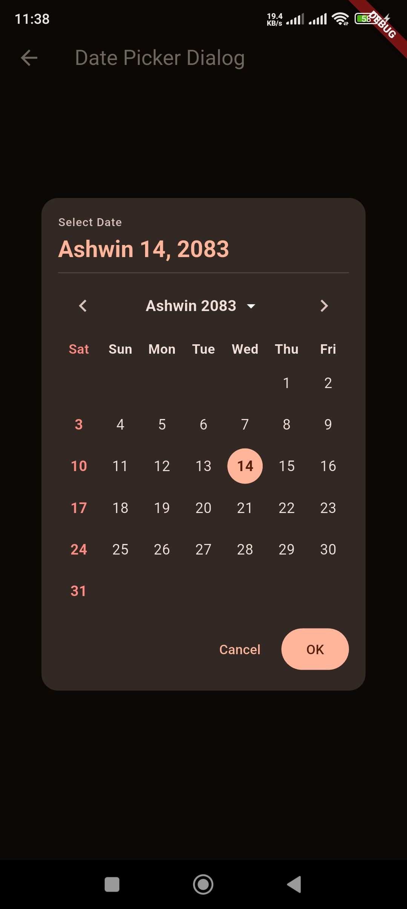
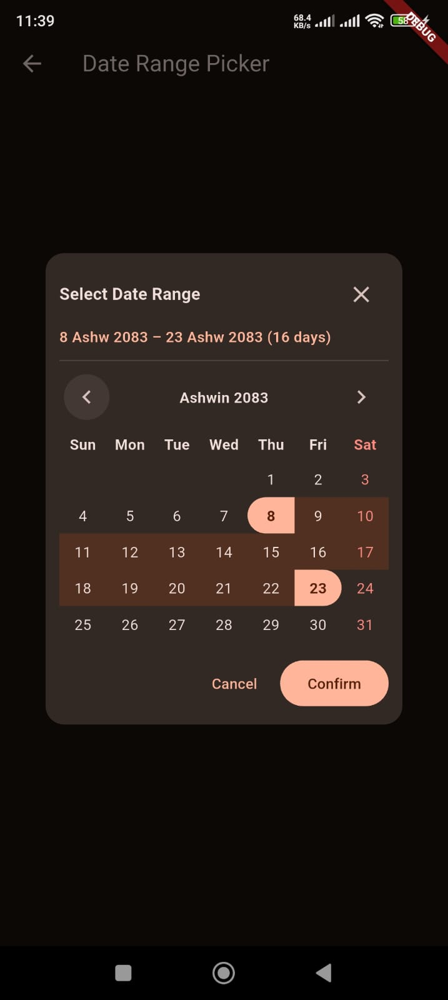
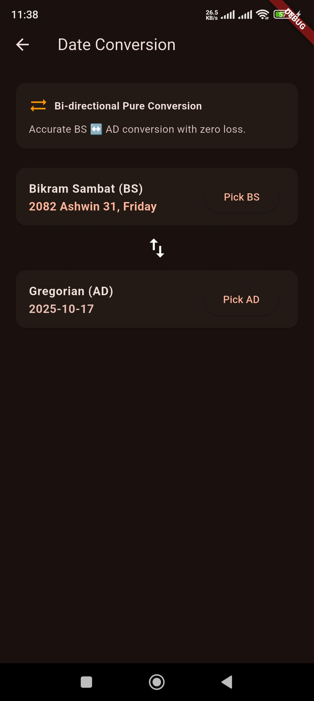
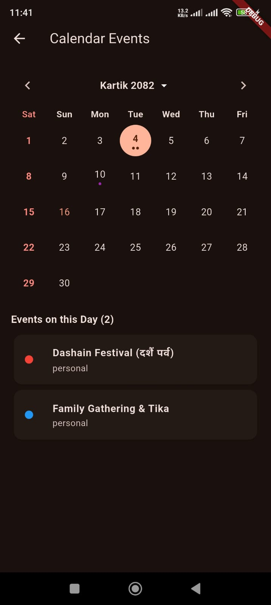
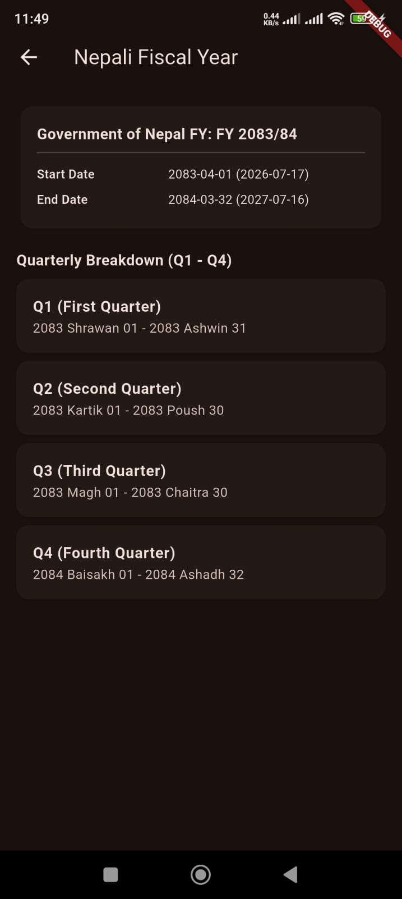
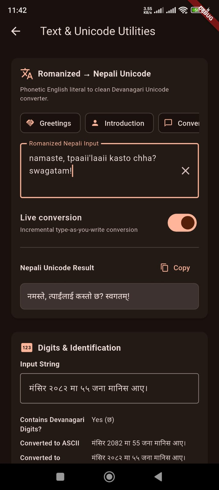

# nepali_kit

A production-quality, all-in-one Nepali calendar, localization, and UI toolkit for Dart and Flutter.

[](https://pub.dev/packages/nepali_kit)
[](LICENSE)
[](test)

---

## Package Introduction

`nepali_kit` provides an enterprise-ready suite of utilities for building Nepali applications in Dart and Flutter. It provides high-speed Bikram Sambat (BS) calendar calculations, verified bidirectional BS ↔ AD date conversions, pattern-based date formatting, South Asian number & currency systems, number-to-words conversions, official fiscal year calculations, public holidays datasets, and Flutter Material 3 calendar and date picker widgets.

---

## Screenshots & Visual Showcase

|                               Bikram Sambat Calendar                                |                                Dual BS + AD Calendar                                 |                               Material 3 Date Picker                                |
| :---------------------------------------------------------------------------------: | :----------------------------------------------------------------------------------: | :---------------------------------------------------------------------------------: |
|  |  |  |

|                                  Date Range Picker                                   |                                Bidirectional Conversion                                |                                    Custom Day Rendering                                    |
| :----------------------------------------------------------------------------------: | :------------------------------------------------------------------------------------: | :----------------------------------------------------------------------------------------: |
|  |  |  |

|                                  Events & Holidays                                   |                                Fiscal Year & Quarters                                 |                                  Numbers & Unicode Utilities                                   |
| :----------------------------------------------------------------------------------: | :-----------------------------------------------------------------------------------: | :--------------------------------------------------------------------------------------------: |
|  |  |  |

---

## Why this package?

In the Dart & Flutter ecosystem, building a Nepali app typically requires stitching together 4 to 6 disparate packages:

- One package for basic BS date calculations,
- Another for number/Devanagari formatting,
- Another for fiscal year math,
- Another for holiday listings,
- And yet another for Flutter calendar UI or date pickers.

This fragmentation leads to:

1. **Conflicting types** (e.g. incompatible `NepaliDateTime` models across libraries),
2. **Inconsistent calendar tables** (subtle discrepancies between day counts across years),
3. **Timezone bugs** (hidden UTC/local conversion side-effects altering days),
4. **Maintenance debt** and dependency hell.

**`nepali_kit` solves this once and for all.** It offers a single, cohesive, thoroughly tested foundation with **zero external dependencies** in its pure Dart core.

---

## Features

- **Calendar Engine**: Immutable `NepaliDate` (date-only) and `NepaliDateTime` (date + time) with equality, comparisons, date ranges, and arithmetic.
- **Date Conversion**: Verified bidirectional conversion ($\text{BS} \leftrightarrow \text{AD}$) with round-trip invariance across 1975 BS to 2099 BS.
- **Formatting & Parsing**: ICU-style format tokens (`yyyy`, `MMMM`, `dd`, `EEEE`, `hh:mm a`) supporting English and Nepali Devanagari locales, plus dual date formatting.
- **Numbers**: South Asian comma grouping (`12,34,567.89`) and conversion between ASCII digits (`0-9`) and Devanagari numerals (`०-९`).
- **Currency**: Currency formatting with custom or localized currency symbols (`रु 12,34,567.89` / `Rs. 12,34,567.89`).
- **Unicode/Text (Number to Words)**: Conversion of numeric amounts into spoken words in both Nepali (`एक लाख तेइस हजार`) and English up to Kharba and Arab.
- **Relative Time (Nepali Moments)**: Human-friendly relative time strings ("भर्खरै", "५ मिनेट अगाडि", "हिजो", "भोलि") in Nepali and English.
- **Fiscal Year**: Accurate Nepali government fiscal year (`NepaliFiscalYear`) starting Shrawan 1 and ending Ashadh end, with automatic Q1–Q4 breakdowns.
- **Holidays**: Built-in national gazetted holidays database for standard years with full support for custom corporate/organization holiday providers.
- **Flutter Calendar**: Customizable Material 3 `NepaliCalendarView` and `ADCalendarView` with multi-event dots, custom builders, and theme support.
- **Date Pickers**: `showNepaliDatePicker`, `showNepaliDateRangePicker`, `NepaliMonthPicker`, and `NepaliYearPicker`.
- **Calendar Events**: Decoupled `CalendarEvent` model with category support, custom metadata, and multi-event day indicators.

---

## Installation

Add `nepali_kit` to your `pubspec.yaml`:

```yaml
dependencies:
  nepali_kit: ^1.0.0
```

### Pure Dart (Backend / CLI / Scripts)

For servers (Dart Frog, Serverpod), scripts, or CLI apps with zero Flutter dependencies:

```dart
import 'package:nepali_kit/nepali_kit_core.dart';
```

### Flutter Applications

For Flutter apps requiring UI widgets, calendar pickers, and themes:

```dart
import 'package:nepali_kit/nepali_kit.dart';
```

---

## Quick Start

```dart
import 'package:nepali_kit/nepali_kit.dart';

void main() {
  // Current Bikram Sambat date
  final today = NepaliDate.now();
  print('Today in BS: $today'); // e.g. 2081-06-13

  // Format with Nepali locale
  final formatted = NepaliDateFormat('EEEE, MMMM d, yyyy', Language.nepali).format(today);
  print('Formatted: $formatted'); // e.g. आइतबार, आश्विन १३, २०८१

  // Numbers to words
  final words = NepaliNumberToWords.convert(125000, language: Language.nepali);
  print('In words: $words'); // एक लाख पच्चीस हजार
}
```

---

## BS ↔ AD Examples

Convert seamlessly between Bikram Sambat and Gregorian calendars:

```dart
import 'package:nepali_kit/nepali_kit_core.dart';

// BS to AD
final bsDate = NepaliDate(2081, 6, 13);
final adDateTime = bsDate.toDateTime(); // 2024-09-29 00:00:00.000

// AD to BS
final gregorian = DateTime(2024, 9, 29);
final convertedBs = NepaliDate.fromDateTime(gregorian); // 2081-06-13

// Direct low-level converter
final (year, month, day) = BsAdConverter.bsToAd(2081, 6, 13);
final (bsY, bsM, bsD) = BsAdConverter.adToBs(year, month, day);

// Fluent DateTime extension
final bsFromExt = DateTime(2024, 9, 29).toNepaliDate();
```

---

## NepaliDate Examples

### Construction & Validation

```dart
// Valid date
final date = NepaliDate(2081, 6, 13);

// Today
final now = NepaliDate.now();

// Properties
print(date.year); // 2081
print(date.month); // 6
print(date.day); // 13
print(date.weekday); // 1 (Sunday / आइतबार)
print(date.monthNameNepali); // आश्विन
print(date.daysInMonth); // 30
print(date.isLeapYear); // false
print(date.startOfMonth); // 2081-06-01
print(date.endOfMonth); // 2081-06-30
```

### Date Arithmetic

```dart
final start = NepaliDate(2081, 3, 32); // Ashadh 32

// Adding days
final after10Days = start.addDays(10); // 2081-04-10 (handles month rollover)

// Month rollover with day-clamping
final nextMonth = start.addMonths(1); // Clamps to max days of Shrawan

// Year rollover
final nextYear = start.addYears(1); // 2082-03-31 (or 32 depending on year data)

// Difference between dates
final daysBetween = after10Days.differenceInDays(start); // 10
```

### Comparisons & Ranges

```dart
final d1 = NepaliDate(2081, 1, 1);
final d2 = NepaliDate(2081, 1, 15);

print(d1 < d2); // true
print(d1.isBefore(d2)); // true

// Date ranges
final range = NepaliDateRange(start: d1, end: d2);
print(range.durationInDays); // 14
print(range.days.length); // 15 dates
```

---

## Formatting Examples

Use `NepaliDateFormat` with standard pattern tokens across English and Nepali locales:

```dart
final dt = NepaliDateTime(2081, 6, 13, 15, 30, 45);

// English locale
final enFormat = NepaliDateFormat('yyyy-MM-dd HH:mm', Language.english);
print(enFormat.format(dt)); // 2081-06-13 15:30

// Nepali Devanagari locale
final npFormat = NepaliDateFormat('EEEE, MMMM dd, yyyy', Language.nepali);
print(npFormat.format(dt)); // आइतबार, आश्विन १३, २०८१

// Dual date formatting (BS + AD together)
final dual = NepaliDateFormat.formatDual(dt, language: Language.nepali);
print(dual); // "२०८१ आश्विन १३ (2024-09-29)"
```

### Supported Pattern Tokens

| Token  | Description      | Output (English) | Output (Nepali) |
| :----- | :--------------- | :--------------- | :-------------- |
| `yyyy` | 4-digit Year     | 2081             | २०८१            |
| `yy`   | 2-digit Year     | 81               | ८१              |
| `MMMM` | Full Month Name  | Ashwin           | आश्विन          |
| `MMM`  | Short Month Name | Ashw             | आ               |
| `MM`   | 2-digit Month    | 06               | ०६              |
| `M`    | 1-digit Month    | 6                | ६               |
| `dd`   | 2-digit Day      | 13               | १३              |
| `d`    | 1-digit Day      | 13               | १३              |
| `EEEE` | Full Weekday     | Sunday           | आइतबार          |
| `EEE`  | Short Weekday    | Sun              | आइत             |
| `HH`   | 24-Hour (00–23)  | 15               | १५              |
| `hh`   | 12-Hour (01–12)  | 03               | ०३              |
| `mm`   | Minute (00–59)   | 30               | ३०              |
| `ss`   | Second (00–59)   | 45               | ४५              |
| `a`    | AM / PM marker   | PM               | अपराह्न         |

---

## Number Examples

### Grouping and Digits

Format numbers with South Asian grouping (last 3 digits, then groups of 2 digits):

```dart
import 'package:nepali_kit/nepali_kit_core.dart';

// South Asian comma grouping (English numerals)
NepaliNumberFormat.format(1234567.89); // "12,34,567.89"

// South Asian comma grouping (Devanagari numerals)
NepaliNumberFormat.format(1234567.89, language: Language.nepali); // "१२,३४,५६७.८९"

// Digit conversion
NepaliDigits.toNepali(2081); // "२०८१"
NepaliDigits.toEnglish('२०८१'); // "2081"
```

### Numbers to Words

Convert numbers to spoken words up to Kharba and Arab:

```dart
// Nepali words
NepaliNumberToWords.convert(123456, language: Language.nepali);
// "एक लाख तेइस हजार चार सय छपन्न"

// English words
NepaliNumberToWords.convert(123456, language: Language.english);
// "One Lakh Twenty Three Thousand Four Hundred Fifty Six"

// Decimals and negatives
NepaliNumberToWords.convert(-50.75, language: Language.nepali);
// "ऋण पचास दशमलव सात पाँच"
```

---

## Currency Examples

Format monetary amounts with standard symbols:

```dart
// Nepali currency format
NepaliNumberFormat.currency(52450.50, language: Language.nepali);
// "रु ५२,४५०.५०"

// English currency format
NepaliNumberFormat.currency(52450.50, language: Language.english);
// "Rs. 52,450.50"

// Custom currency symbol
NepaliNumberFormat.currency(52450, customSymbol: 'NPR');
// "NPR ५२,४५०"
```

---

## Fiscal Year Examples

Nepal's fiscal year runs from **Shrawan 1** to **Ashadh end** (mid-July to mid-July):

```dart
import 'package:nepali_kit/nepali_kit_core.dart';

// Fiscal year from date
final date = NepaliDate(2081, 6, 13);
final fy = NepaliFiscalYear.fromDate(date);

print(fy.label); // "2081/82"
print(fy.shortLabel); // "81/82"
print(fy.startDate); // 2081-04-01 (Shrawan 1)
print(fy.endDate); // 2082-03-31 (Ashadh end)

// Fiscal Quarters
final quarter = fy.quarterForDate(date);
print(quarter.quarter); // FiscalQuarter.first (Q1: Shrawan - Ashwin)
print(quarter.startDate); // 2081-04-01
print(quarter.endDate); // 2081-06-30
```

---

## Holiday Examples

Query national gazetted holidays or inject custom organization holidays:

```dart
import 'package:nepali_kit/nepali_kit_core.dart';

// Check if a date is a public holiday
final date = NepaliDate(2081, 1, 1);
if (HolidayService.isHoliday(date)) {
  final holidays = HolidayService.holidaysOn(date);
  for (final h in holidays) {
    print('${h.nameNepali} (${h.nameEnglish}) - Public: ${h.isPublic}');
  }
}

// Custom holiday provider for companies or schools
HolidayService.registerProvider(CustomHolidayProvider([
  NepaliHoliday(
    date: NepaliDate(2081, 5, 20),
    nameNepali: 'कम्पनी स्थापना दिवस',
    nameEnglish: 'Company Foundation Day',
    isPublic: true,
  ),
]));

// Reset back to official national holidays
HolidayService.reset();
```

---

## Calendar Examples

Embed interactive BS or AD calendars into your Flutter widgets:

```dart
import 'package:flutter/material.dart';
import 'package:nepali_kit/nepali_kit.dart';

class CalendarDemo extends StatefulWidget {
  @override
  State<CalendarDemo> createState() => _CalendarDemoState();
}

class _CalendarDemoState extends State<CalendarDemo> {
  NepaliDate _selectedDate = NepaliDate.now();

  @override
  Widget build(BuildContext context) {
    return NepaliCalendarView(
      initialDate: _selectedDate,
      selectedDate: _selectedDate,
      language: Language.nepali,
      onDateSelected: (date) {
        setState(() => _selectedDate = date);
      },
      events: [
        CalendarEvent(
          date: NepaliDate(2081, 6, 15),
          title: 'Project Deadline',
          category: 'work',
        ),
      ],
    );
  }
}
```

---

## Date Picker Examples

Open a familiar Material 3 modal date picker adapted for Bikram Sambat:

```dart
final picked = await showNepaliDatePicker(
  context: context,
  initialDate: NepaliDate.now(),
  firstDate: NepaliDate(2070, 1, 1),
  lastDate: NepaliDate(2090, 12, 30),
  language: Language.nepali,
  confirmText: 'छान्नुहोस्',
  cancelText: 'रद्द गर्नुहोस्',
);

if (picked != null) {
  print('Selected BS date: $picked');
}
```

---

## Range Picker Examples

Allow users to select an inclusive date span:

```dart
final pickedRange = await showNepaliDateRangePicker(
  context: context,
  firstDate: NepaliDate(2075, 1, 1),
  lastDate: NepaliDate(2085, 12, 30),
  language: Language.nepali,
);

if (pickedRange != null) {
  print('Range start: ${pickedRange.start}');
  print('Range end: ${pickedRange.end}');
  print('Total days: ${pickedRange.durationInDays}');
}
```

---

## Events

Manage calendar events and render multi-indicator badges:

```dart
final eventList = [
  CalendarEvent(
    date: NepaliDate(2081, 7, 15),
    title: 'Laxmi Puja',
    color: Colors.amber,
  ),
  CalendarEvent(
    date: NepaliDate(2081, 7, 15),
    title: 'Family Gathering',
    color: Colors.purple,
  ),
];

final collection = CalendarEventCollection(eventList);
print(collection.hasEvents(NepaliDate(2081, 7, 15))); // true
print(collection.eventsForDate(NepaliDate(2081, 7, 15)).length); // 2
```

---

## Romanized Nepali → Unicode Transliteration

Convert English literal phonetic Romanized Nepali into clean Devanagari Unicode using `NepaliUnicode`:

### Basic Conversion

```dart
import 'package:nepali_kit/nepali_kit.dart';

// Greetings & conversation
final greeting = NepaliUnicode.convert(
  "namaste, tpaaii'laaii kasto chha?",
);
print(greeting);
// नमस्ते, तपाईंलाई कस्तो छ?

// Everyday sentences
final sentence = NepaliUnicode.convert(
  "mero naam Bikash ho, ma nepaalmaa baschhu.",
);
print(sentence);
// मेरो नाम् बिकश् हो, म नेपाल्मा बस्छु.
```

### Live (Type-as-you-write) Conversion

For interactive input fields, set `live: true` to prevent premature character locking while the user continues typing:

```dart
TextField(
  onChanged: (text) {
    final liveNepali = NepaliUnicode.convert(
      text,
      live: true,
    );
    print(liveNepali);
  },
);
```

As the user types incrementally:

- `m` → `म्`
- `ma` → `म`
- `maa` → `मा`
- `maala` → `माल`
- `maalaa` → `माला`

### Notation Reference

- **Vowels:** `a` (अ), `A` / `aa` (आ), `i` (इ), `I` / `ii` (ई), `u` (उ), `U` / `uu` (ऊ), `e` (ए), `E` / `ai` (ऐ), `o` (ओ), `au` (औ)
- **Special Marks:** `'` (Anusvara `ं`), `''` (Chandrabindu `ँ`), `:` (Visarga `ः`), `|` (Danda `।`), `||` (Double Danda `॥`), `om` / `Om` (`ॐ`)
- **Consonant aspirated forms:** `kh` (ख्), `gh` (घ्), `ch` (छ्), `jh` (झ्), `th` (थ्), `dh` (ध्), `ph`/`f` (फ्), `bh` (भ्), `sh` (श्)
- **Retroflex consonants:** `T` (ट्), `Th` (ठ्), `D` (ड्), `Dh` (ढ्), `N` (ण्), `S` (ष्)
- **Digits:** `0-9` automatically map to `०-९`
- **Non-Nepali Content Preservation:** URLs (`https://...`), email addresses (`user@domain.com`), and already-Devanagari Unicode characters are detected and preserved without corruption.

---

## Localization

`nepali_kit` provides first-class support for both English (`Language.english`) and Nepali (`Language.nepali`).
All UI components, date pickers, month names, weekday labels, and number formatters accept a `Language` parameter.

```dart
// Relative time in Nepali
final past = NepaliDate.now().subtractDays(2);
print(NepaliMoment.fromNepaliDate(past, language: Language.nepali)); // "२ दिन अगाडि"

// Relative time in English
print(NepaliMoment.fromNepaliDate(past, language: Language.english)); // "2 days ago"
```

---

## Architecture

`nepali_kit` enforces a strict architectural boundary between pure Dart logic and Flutter UI widgets:

```
nepali_kit/
├── lib/
│   ├── nepali_kit_core.dart       <-- Pure Dart entry point (zero Flutter dependencies)
│   │   ├── src/calendar/          (NepaliDate, NepaliDateTime, ranges, months)
│   │   ├── src/conversion/        (BS <-> AD conversion lookup table engine)
│   │   ├── src/formatting/        (NepaliDateFormat, token parser)
│   │   ├── src/numbers/           (NepaliDigits, NepaliNumberFormat, NumberToWords)
│   │   ├── src/fiscal/            (NepaliFiscalYear, quarters)
│   │   ├── src/holidays/          (Holiday models, datasets, service)
│   │   ├── src/relative_time/     (NepaliMoment)
│   │   ├── src/events/            (CalendarEvent model)
│   │   ├── src/text/              (NepaliUnicode transliteration engine)
│   │   └── src/core/              (Exceptions, constants, Language enum)
│   │
│   └── nepali_kit.dart            <-- Unified entry point for Flutter apps
│       └── src/flutter/           (NepaliCalendarView, pickers, dialogs, themes)
```

- **Backend / CLI safe**: `nepali_kit_core.dart` has zero Flutter imports and compiles seamlessly on Serverpod, Dart Frog, or command-line scripts.
- **Pure-Dart testability**: Core calendar algorithms are verified through pure-Dart unit tests independently of the Flutter engine.

---

## Supported Date Range

| Calendar               | Minimum Date                                           | Maximum Date      |
| :--------------------- | :----------------------------------------------------- | :---------------- |
| **Bikram Sambat (BS)** | **2000-01-01 BS** (or 1975-01-01 BS in verified table) | **2099-12-30 BS** |
| **Gregorian (AD)**     | **1918-04-13 AD**                                      | **2043-04-13 AD** |

- Verified calendar tables guarantee exact month lengths matching official Nepalese _Patro_ records across all 125 supported years.
- Attempting to construct a `NepaliDate` outside this range throws a descriptive [`NepaliDateException`](file:///c:/Users/DELL/Desktop/opensource/nepali_kit/lib/src/core/exceptions.dart).

---

## Limitations

- **Astronomical Predictions beyond 2099 BS**: Because the Bikram Sambat calendar is governed by solar-lunar astronomical positions published annually by Nepal's _Panchanga Nirnayak Samiti_, years beyond 2099 BS are not pre-calculated to prevent historical drift.
- **Tithi Calculations**: Lunar Tithis (such as Ekadashi, Purnima, Amavasya) depend on precise planetary coordinates at specific longitudes and are not included in this calendar engine.

---

## Examples

A comprehensive Flutter example application is included in the `example/` directory demonstrating:

1. Pure BS calendar with day selection,
2. Dual BS + AD calendar,
3. Multi-event indicators,
4. Material 3 modal date picker and range picker,
5. Dark theme and localization switching.

To run the example app:

```bash
cd example
flutter run
```

---

## Testing

The package includes an extensive test suite verifying mathematical invariants, boundary conditions, and UI interactions:

```bash
# Run pure Dart and widget tests
flutter test

# Run static analysis
flutter analyze
```

---

## License

This package is released under the [MIT License](LICENSE).
