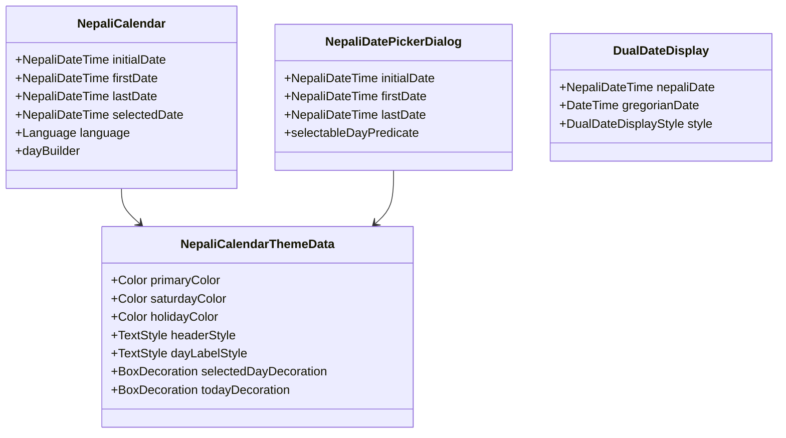

# Internal Architecture Specification: `nepali_kit`

**Document Version:** 1.0.0  
**Status:** Approved Internal Architecture Specification (Pre-Implementation)  
**Target:** Production-Grade All-in-One Nepali Utilities Toolkit for Dart & Flutter  

---

## 1. Directory Structure & Modular Organization

The package is organized to ensure a single package installation for developers (`nepali_kit`), while cleanly isolating pure Dart core logic from Flutter UI widgets.

```text
nepali_kit/
├── pubspec.yaml
├── README.md
├── CHANGELOG.md
├── LICENSE
├── lib/
│   ├── nepali_kit.dart                       # Top-level export: exports core + flutter widgets
│   ├── nepali_kit_core.dart                  # Pure Dart export: zero Flutter imports
│   └── src/
│       ├── core/                             # Foundational shared types & enums
│       │   ├── language.dart                 # Language enum (nepali, english)
│       │   ├── exceptions.dart               # Domain exceptions (NepaliDateException, etc.)
│       │   └── constants.dart                # Calendar bounds (1970–2100), epoch offsets
│       ├── calendar/                         # Calendar date models & arithmetic
│       │   ├── nepali_date_time.dart         # Main immutable NepaliDateTime implementation
│       │   ├── nepali_month.dart             # Month enum (baisakh–chaitra)
│       │   ├── nepali_weekday.dart           # Weekday enum (sunday–saturday)
│       │   └── nepali_date_range.dart        # Immutable date range model
│       ├── conversion/                       # BS ↔ AD conversion engine
│       │   ├── bs_calendar_data.dart         # Compact BS calendar month tables & cumulative days
│       │   ├── bs_ad_converter.dart          # Deterministic O(1) binary-search conversion algorithms
│       │   └── date_extensions.dart          # DateTime ↔ NepaliDateTime extensions
│       ├── formatting/                       # Pattern-based date/time formatters
│       │   ├── nepali_date_format.dart       # ICU-compatible date formatter & parser
│       │   └── format_symbols.dart           # Month/weekday localized token dictionary
│       ├── numbers/                          # Number systems, digits & words
│       │   ├── nepali_digits.dart            # ASCII ↔ Devanagari digit converters
│       │   ├── nepali_number_format.dart     # South Asian grouping (12,34,567.89)
│       │   ├── nepali_currency.dart          # Currency symbols (रु, Rs.) & paisa handling
│       │   └── nepali_number_to_words.dart   # Number-to-words up to Kharba/Shankha
│       ├── text/                             # Unicode text utilities & transliteration
│       │   ├── nepali_unicode.dart           # Romanized to Devanagari transliteration engine
│       │   └── nepali_text_utils.dart        # Devanagari character predicates & collation
│       ├── relative_time/                    # Relative moments engine
│       │   ├── nepali_moment.dart            # "भर्खरै", "५ मिनेट अगाडि" generator
│       │   └── moment_messages.dart          # Localized strings for relative units
│       ├── fiscal/                           # Nepali fiscal year & quarterly accounting
│       │   ├── nepali_fiscal_year.dart       # Shrawan 1 to Ashadh end fiscal year model
│       │   └── nepali_fiscal_quarter.dart    # Q1, Q2, Q3, Q4 quarter models & boundaries
│       ├── holidays/                         # Holiday models & lookup registry
│       │   ├── nepali_holiday.dart           # Holiday model & categories
│       │   ├── holiday_data.dart             # Preloaded national gazetted holidays dataset
│       │   └── holiday_service.dart          # Query & custom holiday registration service
│       └── flutter/                          # Flutter UI components (conditional imports)
│           ├── theme/
│           │   └── nepali_calendar_theme.dart# Material 3 theme extensions & styling
│           ├── calendar/
│           │   ├── nepali_calendar_controller.dart
│           │   ├── nepali_calendar_view.dart # Inline monthly grid view widget
│           │   └── calendar_day_cell.dart    # Individual day cell renderer
│           ├── pickers/
│           │   ├── nepali_date_picker_dialog.dart # Material 3 single date picker
│           │   ├── nepali_date_range_picker_dialog.dart # Date range picker dialog
│           │   └── nepali_month_year_picker_dialog.dart # Fast month/year picker
│           ├── dual_date/
│           │   └── dual_date_display.dart    # Synchronized BS + AD presentation widget
│           └── events/
│               └── calendar_event.dart       # Calendar event marker models
```

---

## 2. Public API Boundaries & Export Policy

### 2.1 The Two Public Entry Points
1. **`lib/nepali_kit_core.dart`**:
   - Contains **zero** imports of `package:flutter/...`.
   - Used by CLI tools, backend frameworks (Serverpod, Dart Frog), pure Dart packages, and scripts.
   - Exports:
     - `src/core/language.dart`
     - `src/core/exceptions.dart`
     - `src/calendar/nepali_date_time.dart`
     - `src/calendar/nepali_month.dart`
     - `src/calendar/nepali_weekday.dart`
     - `src/calendar/nepali_date_range.dart`
     - `src/conversion/bs_ad_converter.dart`
     - `src/conversion/date_extensions.dart`
     - `src/formatting/nepali_date_format.dart`
     - `src/numbers/nepali_digits.dart`
     - `src/numbers/nepali_number_format.dart`
     - `src/numbers/nepali_currency.dart`
     - `src/numbers/nepali_number_to_words.dart`
     - `src/text/nepali_unicode.dart`
     - `src/text/nepali_text_utils.dart`
     - `src/relative_time/nepali_moment.dart`
     - `src/fiscal/nepali_fiscal_year.dart`
     - `src/fiscal/nepali_fiscal_quarter.dart`
     - `src/holidays/nepali_holiday.dart`
     - `src/holidays/holiday_service.dart`

2. **`lib/nepali_kit.dart`**:
   - The primary entry point for Flutter developers.
   - Re-exports everything from `nepali_kit_core.dart`.
   - Additionally exports Flutter UI widgets:
     - `src/flutter/theme/nepali_calendar_theme.dart`
     - `src/flutter/calendar/nepali_calendar_view.dart`
     - `src/flutter/calendar/nepali_calendar_controller.dart`
     - `src/flutter/pickers/nepali_date_picker_dialog.dart`
     - `src/flutter/pickers/nepali_date_range_picker_dialog.dart`
     - `src/flutter/pickers/nepali_month_year_picker_dialog.dart`
     - `src/flutter/dual_date/dual_date_display.dart`
     - `src/flutter/events/calendar_event.dart`

### 2.2 Private Implementation Details
The following remain strictly private to the package (not exported directly from either root):
- `src/conversion/bs_calendar_data.dart` (Internal raw byte/integer tables).
- `src/formatting/format_symbols.dart` (Internal localized token mapping tables).
- `src/holidays/holiday_data.dart` (Internal raw holiday definitions).
- `src/relative_time/moment_messages.dart` (Internal grammar tables).
- `src/flutter/calendar/calendar_day_cell.dart` (Internal rendering subcomponent).

---

## 3. Bikram Sambat (BS) Calendar Data & Conversion Engine

### 3.1 Astronomical Background & Constraints
Unlike the Gregorian calendar which follows a mathematical leap-year rule, the Bikram Sambat calendar is a solar lunisolar calendar whose month durations (ranging from 29 to 32 days) are determined by the sun's ingress into different zodiac signs (Sankranti). Because of slight perturbations in the Earth's orbit and astronomical calculations officially determined by Nepal Panchanga Nirnayak Samiti, Bikram Sambat month lengths cannot be modeled purely with a simple formula.

### 3.2 Internal Data Representation
To achieve optimal memory usage, zero external assets, and instant initialization without disk or network I/O:
1. **Time Span:** 1970 BS (approx 1913 AD) through 2100 BS (approx 2043 AD) — 131 complete years.
2. **Data Structure:** A contiguous lookup array of 131 elements where each year's 12 months are packed into a compact integer or byte sequence.
   - Each month length varies between 29 and 32 days (only 4 possible values: $29, 30, 31, 32$).
   - 4 values can be represented in 2 bits ($32 - 29 = 3 \le 2^2 - 1$). Thus 12 months require only $12 \times 2 = 24$ bits, easily fitting inside a single 32-bit unsigned integer per year!
   - Alternative high-speed representation: A `List<int>` where each element is a 12-integer array `const [30, 32, 31, 32, 31, 30, 30, 30, 29, 30, 29, 31]`. At 131 entries, this is less than 1.5 KB of memory and offers direct index access without bit manipulation overhead.
3. **Cumulative Days Table (Prefix Sums):**
   - We precompute a cumulative day offset array `_cumulativeDays[year - 1970]` from the anchor epoch.
   - Anchor: `1970-01-01 BS` = `1913-04-13 AD` (Sunday).
   - This turns year lookups into an $O(1)$ direct array index, or at most an $O(\log N)$ binary search across 131 elements during reverse conversion.

### 3.3 The Deterministic Conversion Algorithm

```mermaid
flowchart TD
    subgraph AD_to_BS ["AD to BS Conversion"]
        A[Gregorian DateTime] --> B[Calculate days difference from Anchor AD 1913-04-13]
        B --> C[Binary search cumulative BS days table to find target BS Year]
        C --> D[Subtract year offset to find day of year]
        D --> E[Iterate 12 month days of target year to find Month and Day]
        E --> F[Retain hour, min, sec, ms from source AD]
        F --> G[Construct immutable NepaliDateTime]
    end

    subgraph BS_to_AD ["BS to AD Conversion"]
        H[NepaliDateTime] --> I[Validate BS year, month, day bounds]
        I --> J[Lookup cumulative days for BS Year + sum preceding months + day - 1]
        J --> K[Add total days offset to Anchor AD 1913-04-13]
        K --> L[Retain time components]
        L --> M[Construct Gregorian DateTime]
    end
```


### 3.4 Accuracy Verification & Test Suite
- Deterministic bi-directional round-trip invariant:  
  $$\forall d \in [1970\text{ BS}, 2100\text{ BS}]: \text{toNepaliDate}(\text{toGregorianDate}(d)) \equiv d$$
- Automated test runs over every single day across 131 years (over 47,800 days) in CI to ensure 0 divergence.

---

## 4. Immutable Domain Models & State Management

All domain entities are declared with `@immutable` from `package:meta/meta.dart`.

### 4.1 `NepaliDateTime` Internals
```dart
@immutable
class NepaliDateTime implements Comparable<NepaliDateTime> {
  final int year;
  final int month;
  final int day;
  final int hour;
  final int minute;
  final int second;
  final int millisecond;
  final int microsecond;
  final bool isUtc;

  // Cached internal Gregorian epoch timestamp for lightning-fast comparisons & arithmetic
  final int _millisecondsSinceEpoch;

  // Private canonical constructor
  const NepaliDateTime._internal(
    this.year,
    this.month,
    this.day,
    this.hour,
    this.minute,
    this.second,
    this.millisecond,
    this.microsecond,
    this.isUtc,
    this._millisecondsSinceEpoch,
  );
}
```
- **Arithmetic Invariance:** `add(Duration duration)` adds duration directly to `_millisecondsSinceEpoch` and converts back to `NepaliDateTime`, preventing leap-year and variable month-length arithmetic drift.
- **Equality & Hashing:** Overrides `operator ==` and `hashCode` based on `_millisecondsSinceEpoch` and `isUtc`.

---

## 5. Formatter & Parser Architecture

### 5.1 Format Token Pipeline
The formatter breaks patterns into an internal list of token evaluators:
```dart
abstract class _FormatToken {
  String evaluate(NepaliDateTime date, Language language);
}
```
- **Year Tokens:** `_YearToken` (`yyyy`, `yy`) $\rightarrow$ renders numbers, translated to Devanagari digits if `language == Language.nepali`.
- **Month Tokens:** `_MonthToken` (`MMMM`, `MMM`, `MM`, `M`) $\rightarrow$ pulls localized strings from `format_symbols.dart`.
- **Day Tokens:** `_DayToken` (`dd`, `d`) $\rightarrow$ padded or unpadded digits.
- **Weekday Tokens:** `_WeekdayToken` (`EEEE`, `EEE`) $\rightarrow$ `आइतबार`, `आइत`, `Sunday`, `Sun`.
- **Time Tokens:** `_HourToken`, `_MinuteToken`, `_SecondToken`, `_AmPmToken`.

### 5.2 Parsing Engine
- `NepaliDateFormat.parse(String input)` utilizes regex generated from the token structure.
- Handles both Devanagari numerals (`२०८१/०६/१३`) and ASCII digits (`2081/06/13`). All Devanagari numbers are normalized to ASCII before parsing.

---

## 6. Numbers, Currency & Number-to-Words Architecture

### 6.1 South Asian Comma Grouping Algorithm
Unlike Western 3-digit groupings (`1,000,000`), the Nepali/Indian numbering system groups the last 3 digits for hundreds, and then pairs of 2 digits for thousands, lakhs, and crores (`10,00,000`).
```dart
// Internal grouping pipeline:
// 1. Separate sign and fractional parts.
// 2. Extract rightmost 3 digits.
// 3. Loop over remaining digits, taking groups of 2.
// 4. Join groups with comma separator.
// 5. Append fractional part and prepend sign.
// 6. If Language.nepali, map all ASCII digits to Devanagari digits.
```

### 6.2 Number to Words Engine
Hierarchical scale breakdown:
- 0–99: Direct lookup table in `number_to_words.dart` (covers all distinct Nepali number words from शून्य to नउन्नब्बे).
- Hundreds (सय), Thousands (हजार), Lakhs (लाख), Crores (करोड), Arba (अरब), Kharba (खर्ब), Shankha (शंख).
- Supports currency suffixing (`रुपैयाँ`, `पैसा`) with proper pluralization and singular handling ("एक रुपैयाँ" vs "पाँच रुपैयाँ").

---

## 7. Nepali Fiscal Year & Quarters Architecture

### 7.1 Lifecycle of a Nepali Fiscal Year
- A Nepal fiscal year starts on **Shrawan 1** (month 4) and terminates on **Ashadh last day** (month 3 of the next year).
- **Start Year Determination:**
  - If date month $\ge 4$ (Shrawan through Chaitra): Fiscal year start year is `date.year`.
  - If date month $< 4$ (Baisakh through Ashadh): Fiscal year start year is `date.year - 1`.
- **Quarter Divisions:**
  - **Q1:** Shrawan 1 – Ashoj (month 4 to 6)
  - **Q2:** Kartik 1 – Poush (month 7 to 9)
  - **Q3:** Magh 1 – Chaitra (month 10 to 12)
  - **Q4:** Baisakh 1 – Ashadh (month 1 to 3)

---

## 8. Public Holidays & Events Architecture

### 8.1 Data Structure & Storage
- `NepaliHoliday` is an immutable record:
  - `id`: Unique string identifier (`'dashain_bijaya_dashami_2081'`).
  - `nameNepali`, `nameEnglish`: Localized festival names.
  - `date`: `NepaliDateTime`.
  - `category`: `HolidayCategory.national`, `HolidayCategory.religious`, etc.
  - `isPublicHoliday`: Boolean flag for official office/bank closure.
- **Storage Strategy:** Core national public holidays are bundled as a lightweight constant lookup map keyed by year: `Map<int, List<NepaliHoliday>>`.
- **Extensibility:** `NepaliHolidayService.registerCustomHolidays(List<NepaliHoliday>)` allows applications to dynamically register organization-specific, local municipal, or school holiday calendars.

---

## 9. Flutter UI Widget Architecture



### 9.1 Theming Architecture (`NepaliCalendarThemeData`)
- Inherits styling from ambient `Theme.of(context)` (supporting Material 3 `ColorScheme` and dark/light modes automatically).
- Dedicated properties for Nepali-specific conventions:
  - `saturdayColor`: Defaults to `colorScheme.error` or soft red, honoring Nepal's Saturday weekend standard.
  - `holidayColor`: Subtle accent or dot indicator for gazetted holidays.
  - `fontFamily`: Clean fallback to system Devanagari fonts.

### 9.2 Pickers & Dialogs
- `showNepaliDatePicker`: Built on top of a responsive Material 3 dialog container with smooth header animations, month-year selection dropdowns, and keyboard accessibility.
- `showNepaliDateRangePicker`: Displays a scrollable continuous calendar grid with high-performance range highlight decorators.

---

## 10. Error Handling & Validation Strategy

1. **Domain Exceptions**:
   - `NepaliDateException`: Thrown when an invalid date is constructed (e.g. Month 13, or Day 32 in a 30-day month).
   - `NepaliDateParseException`: Thrown when a string fails format parsing, containing the erroneous input and target pattern.
   - `ConversionOutOfBoundsException`: Thrown when attempting to convert dates outside the verified range ($1970 \le \text{year} \le 2100$).
2. **Safe Validation Functions**:
   - `NepaliCalendarData.isValidBsDate(year, month, day)`: Returns `bool` without throwing.
   - `NepaliDateTime.tryParse(string)`: Returns `NepaliDateTime?` returning `null` on failure.

---

## 11. Architectural Compliance Checklist

| Requirement | Implementation Verification |
|---|---|
| Single package installation | Single package `nepali_kit` published on pub.dev. |
| Internally modular | Clear subdirectories under `lib/src/` for calendar, numbers, fiscal, etc. |
| Pure Dart decoupled core | `nepali_kit_core.dart` has zero Flutter imports. |
| Flutter widgets layered | Flutter widgets isolated under `src/flutter/` and exposed via `nepali_kit.dart`. |
| Zero runtime bloat | Self-contained, lightweight, no third-party runtime package dependencies. |
| Controlled public surface | Clean top-level exports with internal classes kept private. |
| Deterministic conversion | Constant-time lookup tables with mathematical bi-directional round-trip invariants. |
